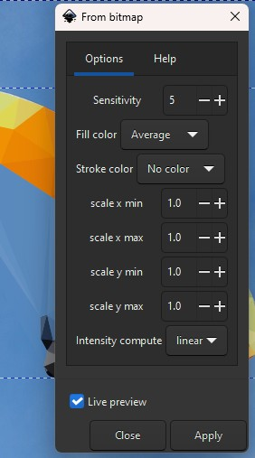

= Color from Bitmap : Inkscape extension

version 1.0

== brief

Grab color from underlying bitmap and apply it to path objects.
The color is averaged all over the path area. Erode parameter can be used
to shrink or expand (using negative value) this area.

== Options

- `Sensitivity`: Erodes (see morpho math transformations) the footprint of the shape onto the image.
It can be used to emphasize the contrast. If negative value is given,
it will dilate the area, and then smoothen the contrast between adjacent areas.

- `Fill color`: How to replace the inner color of selected shapes.
It can be `unchanged`, `nofill` (Empty color), `average`.

- `Stroke color`: How to replace the stroke color of selected shapes.
It can be `unchanged`, `nofill` (Empty color), `average`.

- `scale_x_min` and `scale_x_max`: will remap the image intensity to a scale factor on horizontal axis.
If both values are set to `1.0`, it will have no effect.

- `scale_y_min` and `scale_y_max`: same as `scale_x_min` and `scale_x_max` on vertical axis.
Copy scale x if you want to keep aspect ratio.

- `intensity`: Method used to evaluate light intensity on a pixel.
`sRGB` takes the raw RGB values, `linear` make convert to values proportional to light emission.

== Known limitations

- Only consider a single image. If multiple bitmaps are selected, only one is considered.
- Only handle path objects: does not work on rectangles, circles, ... Make sure to convert objects to paths.
- Only works with straight paths: bezier area are approximated using straight lines.
- Dilatation (negative erosion) have weird corners.
- Ignore any clipping on the image.
- slow

== Low poly example

In this example, I describe how to use this extension to speed up a low poly design.

First, place markers at key places (triangles corners). See below example.

image::examples/delaunay-1.png[dots,400,400]

Then generates a triangle mesh, using a delaunay triangulation, as shown below:

Once you have the following mesh,

image::examples/delaunay-2.png[mesh,400,400]

you can colorize it, using the "from bitmap" color extension.
Make sure you have both the image and the mesh selected.

Choose your settings, and apply.

You should end up with colorized objects, like below:

